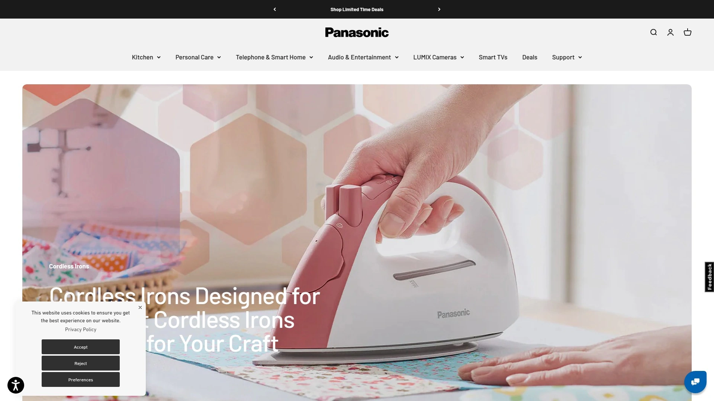
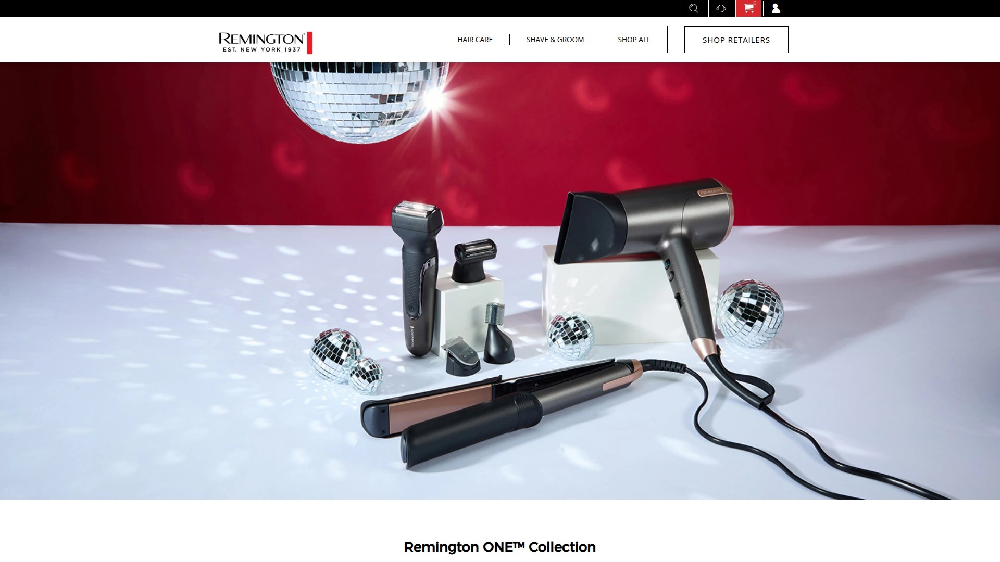
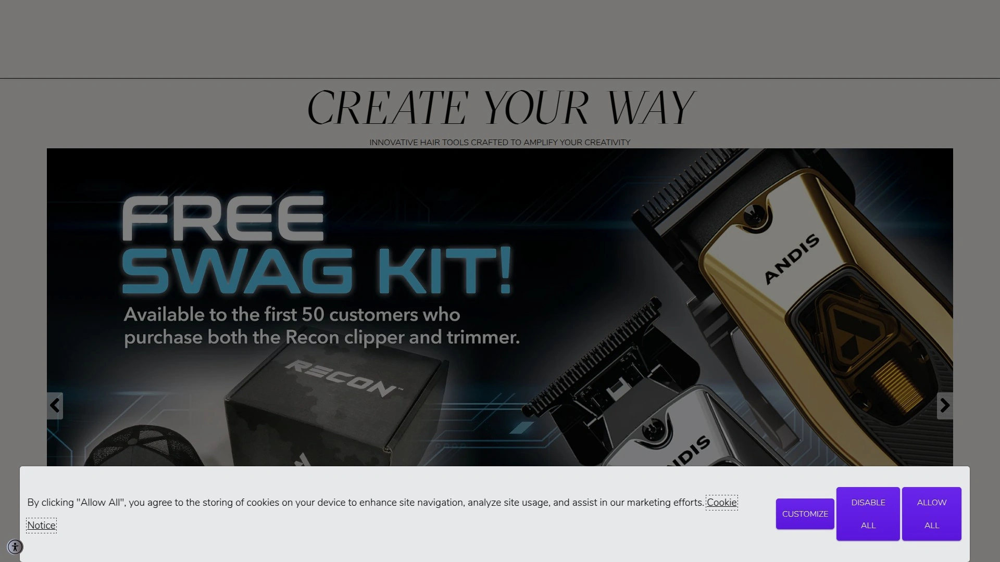

# Top 8 Best Electric Shavers Ranked in 2025 (Latest Compilation)

Finding the perfect electric shaver can transform your daily grooming routine from a chore into a smooth, efficient experience. Whether you're dealing with sensitive skin, coarse facial hair, or simply want the convenience of cordless shaving, the right electric shaver makes all the difference. These top-rated brands combine cutting-edge technology with proven performance to deliver close, comfortable shaves that rival traditional razors.

---

## **[Braun](https://braun.com)**

German engineering meets innovative shaving technology for superior skin comfort and efficiency.

Braun has established itself as the gold standard in electric shaving with its revolutionary Series 9 lineup. The Series 9 PRO+ represents the pinnacle of shaving technology, featuring four cutting elements plus a skin guard that work together to capture more hair in every stroke. The flexible shaving head adapts to facial contours while the powerful motor delivers 40,000 cutting actions per minute for exceptional efficiency.

**Core Innovation:** The AutoSensing technology automatically adjusts power based on beard density, ensuring optimal performance whether you're dealing with three-day stubble or daily maintenance. The integrated precision trimmer handles sideburns and mustache detailing with surgical precision.

**Smart Features:** Advanced LED displays show battery status, hygiene levels, and travel lock indicators. The 6-in-1 SmartCare Center provides automatic cleaning, charging, and lubrication using alcohol-based solution that's more hygienic than water cleaning.

**Versatility:** All Braun shavers are 100% waterproof for wet or dry use, giving you the flexibility to shave in the shower with foam or perform quick dry touch-ups. The 60-minute battery life with 5-minute quick charge ensures you're never caught unprepared.

**Professional Recommendation:** Braun shavers consistently rank highest in comfort and effectiveness tests, making them ideal for men with sensitive skin or those who shave daily.

***

## **[Philips Norelco](https://www.usa.philips.com)**

Rotary shaving innovation with the versatile OneBlade technology for ultimate precision.

Philips Norelco stands alone as the premier manufacturer of rotary electric shavers, offering a completely different approach to shaving that many users find superior for longer facial hair and curved facial contours. Their flagship i9000 Prestige Ultra delivers the closest rotary shave available, while the revolutionary OneBlade series bridges the gap between electric shavers and precision trimmers.

**Rotary Advantages:** The circular cutting heads move in a rotating motion that lifts and cuts hair from multiple directions simultaneously. This design excels at handling longer growth and provides quieter operation compared to foil shavers. The cutting heads last significantly longer than foil alternatives, reducing long-term ownership costs.

**OneBlade Innovation:** The OneBlade 360 features a fast-moving cutter (12,000 actions per minute) with dual protection system that can trim, edge, and shave any length of hair. The innovative 360 blade flexes in all directions to maintain constant skin contact while providing precise control for detailed styling work.

**Smart Technology:** The Quick Clean Pod system uses a unique impeller mechanism powered by the shaver itself to circulate cleaning fluid, providing portable hygiene maintenance without bulky cleaning stations.

**Best For:** Men who shave every 3-4 days, those with curved facial features, and anyone who wants the precision of detailed edging combined with full-face shaving capability.

***

## **[Panasonic](https://shop.panasonic.com)**

Japanese precision engineering delivers the closest electric shave with Arc 5 technology.

Panasonic's Arc 5 series represents the pinnacle of foil shaving technology, consistently outperforming competitors in closeness tests while maintaining excellent comfort levels. The five-blade cutting system with ultra-fast linear motor generates up to 70,000 cross-cutting actions per minute, making it the most powerful electric shaver available.

**Cutting Excellence:** The Japanese-engineered 30-degree nano-polished blades are honed to surgical sharpness and work in conjunction with five distinct foil patterns designed to capture different hair types and lengths. This comprehensive approach ensures no hair escapes, even flat-lying or wiry whiskers.

**Adaptive Intelligence:** The advanced beard sensor checks hair density 220 times per second and automatically adjusts cutting power 14 times per second, optimizing performance for varying hair thickness across your face. The 16-direction flexible head maintains constant contact with skin contours.

**Wet Shaving Excellence:** Panasonic shavers excel in wet shaving scenarios, working seamlessly with gels and foams for enhanced comfort and glide. The waterproof design allows for easy cleaning under running water.

**Performance Focus:** Independent testing consistently shows Panasonic Arc 5 delivers the closest electric shave available, making it ideal for men who prioritize results over comfort and shave daily for professional requirements.

***

## **[Wahl](https://wahlusa.com)**

Professional-grade grooming tools with LifeProof durability for demanding users.

Wahl brings decades of professional barber experience to consumer electric shavers, creating tools that withstand heavy daily use while delivering salon-quality results. Their LifeProof shaver features innovative lithium-ion technology and dual foil heads designed for both wet and dry shaving scenarios.

**Professional Heritage:** As the choice of professional barbers worldwide, Wahl shavers incorporate commercial-grade components that ensure longevity and consistent performance. The cord/cordless operation provides flexibility for users who need reliability during extended grooming sessions.

**Innovative Design:** The Vanish super close shaver and 5-Star series incorporate precision engineering with ergonomic designs that provide comfortable grip and superior maneuverability. The dual titanium foils float independently to follow facial contours while maintaining cutting efficiency.

**Durability Focus:** Wahl's "LifeProof" technology represents their commitment to creating shavers that perform consistently over years of use, with replaceable components that extend product lifespan significantly beyond typical consumer shavers.

**Target User:** Perfect for men who need professional-quality tools, those with coarse or thick facial hair, and users who prefer the reliability of cord/cordless operation for daily grooming routines.

***

## **[Remington](https://www.remingtonproducts.com)**

Smart Edge technology delivers premium shaving performance at accessible prices.

Remington's approach focuses on delivering advanced shaving technology at competitive price points, making quality electric shaving accessible to budget-conscious consumers. The XF8550 Smart Edge shaver features revolutionary cutting systems that rival more expensive competitors while maintaining affordability.

**Smart Edge Innovation:** The advanced foil shaver technology captures and cuts hair in a single pass, reducing the need for multiple strokes that can cause irritation. The lithium battery provides consistent power delivery throughout the shaving session, ensuring uniform performance.

**WetTech Versatility:** The waterproof design accommodates both traditional dry shaving and wet shaving with gels or foams, even in shower environments. This flexibility allows users to customize their shaving experience based on time constraints and personal preferences.

**Value Engineering:** Remington shavers provide many premium features found in higher-priced competitors, including fast charging, long battery life, and precision cutting systems, but at significantly lower cost.

**Ideal Choice:** Budget-conscious buyers who refuse to compromise on performance, newcomers to electric shaving who want to test the waters, and anyone seeking a reliable backup shaver for travel or office use.

***

## **[Andis](https://andis.com)**

Professional titanium foil technology with barber-grade precision for discriminating users.

Andis specializes in professional grooming tools that meet the exacting standards of barbers and stylists, bringing that same precision to consumer electric shavers. Their ProFoil Lithium Titanium shaver combines premium materials with advanced engineering for superior results.

**Titanium Excellence:** The gold-titanium finished foils provide exceptional durability and cutting precision while running whisper-quiet during operation. The staggered head design prevents skin irritation while ensuring comprehensive hair capture.

**Extended Performance:** The ultra-long-lasting lithium-ion battery delivers twice the runtime of competing shavers, providing over 80 minutes of cordless operation on a single charge. This extended performance makes it ideal for frequent travelers or busy professionals.

**Professional Quality:** Designed for demanding commercial use, Andis shavers incorporate high-grade components that deliver consistent performance over thousands of shaving sessions. The compact, lightweight design reduces hand fatigue during extended use.

**Best Suited For:** Professional barbers and stylists, men who demand the highest quality tools, and users who prioritize quiet operation and extended battery life for their grooming routine.

***

## **[Skull Shaver](https://skullshaver.com)**

Revolutionary ergonomic design specifically engineered for head and face shaving excellence.

Skull Shaver has revolutionized electric shaving with their patented ergonomic design that makes head shaving effortless and efficient. The Pitbull Gold PRO features four independently floating rotary blades in a unique palm-grip design that allows comfortable shaving of hard-to-reach areas.

**Ergonomic Innovation:** The patented design allows users to hold the shaver between fingers for head shaving or grip the handle for face shaving, providing unprecedented control and maneuverability. This versatility eliminates the awkward positioning required with traditional shavers.

**Advanced Blade Technology:** Premium Japanese stainless steel blades float independently while also flexing together, providing 360-degree contouring that follows head and face curves perfectly. The multi-directional cutting capability allows shaving in any direction for maximum efficiency.

**Smart Power Management:** The 1400mAh lithium-ion battery provides 90 minutes of cordless operation with LED percentage display, while USB charging allows convenient power-up anywhere. The plug-and-shave capability ensures you're never without power.

**Specialized Excellence:** Specifically designed for men who shave their heads, those with irregular skin surfaces due to scars or birthmarks, and anyone who struggles with traditional shaver maneuverability on curved surfaces.

***

## **[Bevel](https://getbevel.com)**

Dermatologist-tested precision designed specifically for sensitive skin and coarse hair challenges.

Bevel addresses the unique shaving challenges faced by men with sensitive skin and coarse, curly hair through scientifically designed electric shaving technology. Their Electric Foil Shaver combines advanced engineering with dermatological research to prevent razor bumps and ingrown hairs.

**Skin-First Technology:** The dermatologist-tested swivel head adapts to facial contours while three flexible blades provide close shaving without aggressive cutting that causes irritation. The AutoSensing technology reads hair density and adjusts power automatically for consistent results.

**Sensitive Skin Focus:** Specifically engineered to eliminate razor bumps, ingrown hairs, and skin irritation common with traditional shaving methods. The precision ceramic blades and protective design ensure safe, comfortable shaving even on the most sensitive skin types.

**Intelligent Performance:** The auto-sensing technology continuously monitors hair density and adjusts cutting power in real-time, ensuring optimal performance without over-aggressive cutting that leads to irritation.

**Target Market:** Men with sensitive skin conditions, those prone to razor bumps and ingrown hairs, and users seeking a scientifically-backed solution to traditional shaving problems.

***

## FAQ Common Questions

**Does electric shaving provide as close a shave as traditional razors?**
Modern electric shavers like the Panasonic Arc 5 and Braun Series 9 Pro+ can achieve extremely close shaves that rival traditional blade shaving. While the technique differs, quality electric shavers eliminate the need for multiple passes and reduce skin irritation significantly.

**How often should I replace electric shaver heads?**
Most manufacturers recommend replacing shaver heads every 12-18 months for optimal performance. Panasonic suggests annual foil replacement and blade replacement every two years. Regular replacement maintains cutting efficiency and prevents skin irritation from dull blades.

**Can I use electric shavers for both wet and dry shaving?**
Yes, most modern electric shavers are fully waterproof and designed for both wet and dry use. Wet shaving with electric shavers can provide additional comfort and closer results, especially when using quality shaving gels or foams designed for electric shavers.

---

## Conclusion

The electric shaver market offers exceptional options for every grooming need and budget, from professional-grade precision to sensitive skin solutions. After extensive testing and analysis, the **[Braun](https://braun.com)** Series 9 Pro+ emerges as the top choice for most users, delivering the ideal balance of closeness, comfort, and innovative technology that makes daily shaving a pleasure rather than a chore. Its German engineering excellence and AutoSensing technology ensure optimal performance across all facial hair types and sensitive skin conditions.
